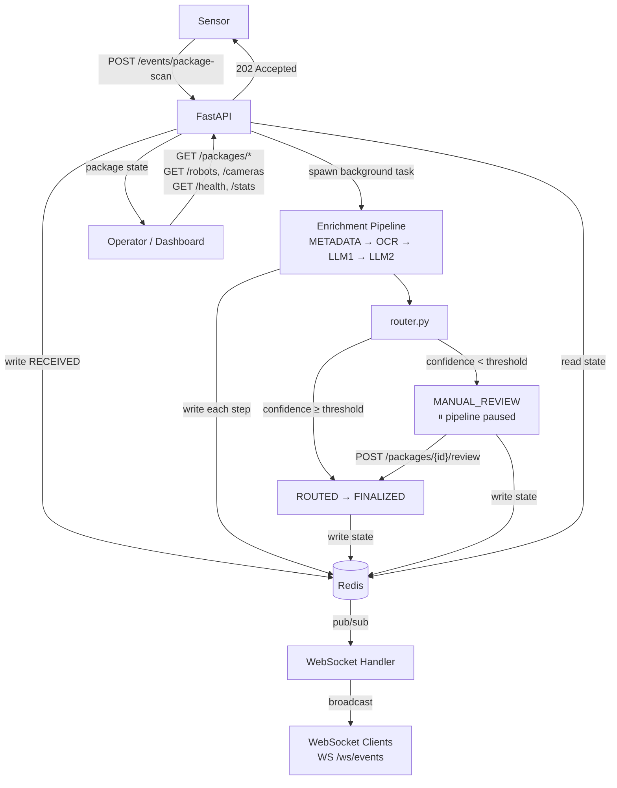

# PrimeVision SSE — Real-Time Package Event Orchestrator

## Setup

```bash
docker compose up --build
```

API at `http://localhost:8000` — interactive docs at `/docs`.

**Tests (no Docker required):**
```bash
pip install -r requirements.txt -r requirements-dev.txt
pytest tests/ -v
```

> Tests suppress `RuntimeWarning: coroutine 'run_pipeline' was never awaited`. This is expected — scan endpoint tests mock `asyncio.create_task`, so the coroutine is created but never awaited. Not a bug; suppressed in `pytest.ini`.

---

## Architecture



- **FastAPI background tasks** — scan returns 202 immediately; enrichment runs async. Tradeoff: job lost if server crashes mid-pipeline.
- **Redis dual role** — hashes for package state, pub/sub for WebSocket broadcasting. App layer is stateless; multiple instances scale horizontally with correct broadcast.
- **Swappable router** — `router.py` returns `(route, confidence)`. ML-based router can replace rule-based without touching the pipeline.
- **MANUAL_REVIEW as first-class state** — low-confidence packages pause here until a floor operator acts via `POST /packages/{piece_id}/review`.

---

## Scalability Considerations

- **Stateless app layer** — all state lives in Redis; adding app instances requires no coordination layer
- **WebSocket broadcast correctness** — Redis pub/sub ensures every client gets every update regardless of which instance they connect to
- **Current bottleneck** — the enrichment pipeline runs as an in-process background task; replacing it with Celery workers enables independent scaling of processing capacity

---

## Failure Handling

- **Duplicate `piece_id`** — idempotency check returns current state; pipeline not re-run.
- **Enrichment failures** — each step retries N times (configurable); package marked `FAILED` after exhaustion.
- **Invalid payloads** — Pydantic returns 422 with field-level detail.
- **Low-confidence routing** — paused at `MANUAL_REVIEW`; stuck packages surfaced at `GET /packages/stuck`.
- **Redis unavailable** — surfaced at `GET /health`.

---

## Observability

- `GET /health` — app + Redis reachability
- `GET /packages/stats` — throughput, status breakdown, error rate
- `GET /robots` / `GET /cameras` — last-seen timestamps, staleness flags
- `GET /packages/stuck` — MANUAL_REVIEW items past staleness threshold
- `GET /packages/failed` — failed enrichments with no retries remaining
- `WS /ws/events` — real-time stream of every state transition

---

## Production Improvements

- **Celery or Kafka** — resilient pipeline that survives restarts; independent worker scaling
- **Postgres alongside Redis** — durable audit trail; Redis stays for hot state and pub/sub
- **ML-based router** — plug into `router.py`; reduces manual review rate over time
- **Rate limiting** on the scan endpoint against sensor misconfiguration
- **Role-based access** on operator endpoints for attributability
